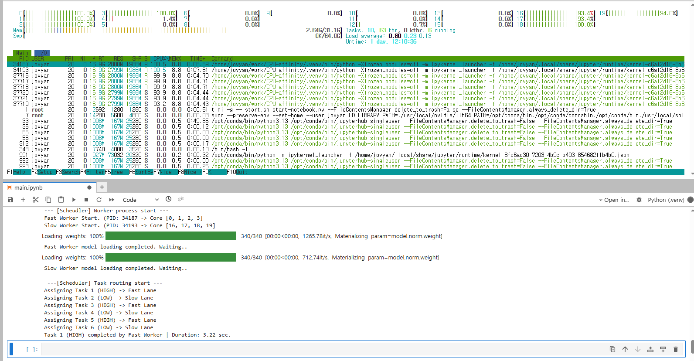

# Hybrid CPU Core Scheduling & Optimization
'Priority-based Process Scheduling' analyzes the physical characteristics of P-Core(performance) and E-core(efficiency) in a heterogeneous CPU architecture environment and allocatest cores according to the important of the task.

---
## Overview
Modern CPU utilze a hybrid architecture that combined P-core and E-core. However, relying solely on the OS' default scheduler can result in high-performance AI inference tasks being assigned to E-core or a bottleneck occuring due to the mixing of cores of different characteristics.

---
## Environment
**OS**: Linux(Docker Container Environment)

**CPU**: 12th Gen Intel(R) Core(TM) i7-12700
* **P-Core:** 8 Cores (0~15 threads) - High Performance
* **E-Core:** 4 Cores (16~19 threads) - High Efficiency

**Library**: torch, transformers, psutil, multiprocessing

---
## Experiments & Analysis

### Experiments 1: P-core vs. E-core performance comparison
* **P-core only:** Average 2.65 seconds
* **E-core only:** Average 3.71 seconds
* **Result:** P-Core shows approximately 1.4x faster inference performance than E-Core.

### Experiment 2: Mixed Core Usage
Measures performance when P-cores and E-cores are mixed and assigned to a single task group.
* **Result:** 3.71 seconds.
* **Analysis:** During Parallel processing, a synchronization barrier phenomenon occurs, requiring the fastest worker(P-core) to wait until the slowest worker(E-core) completes its task. Mixin is inefficient.

### Experiment 3: Priority-based Scheduling
An architecture that seperates queues based on the importance(High/Low) of tasks and assigns dedicated worker process.
* **Architecture:**
  * **Fast Lane** P-Core(0~3)
  * **Slow Lane** E-core(16~19)
  * **Scenario:** 3 High Priority tasks, 3 Low Priority tasks. Request to execute 6 tasks simultaneously.

## Final Results
| Task Type | Worker Process | Core Affinity | Avg Duration |
| :--- | :--- | :--- | :--- |
| **High Priority** | Fast Worker | P-Core (0~3) | **3.22 sec** |
| **Low Priority** | Slow Worker | E-Core (16~19) | **4.63 sec** |

* **Process Isolation:** `htop` monitoring result confirmed that P-Core and E-Core operate 100% independently without interference with each other.
* **Total Throughput:** Achieved a time reduction of approximately 40% compared to sequential processing (Total 13.38 sec)

*Actual htop monitoring results: P-Core and E-Core groups clearly operate separtely.*
